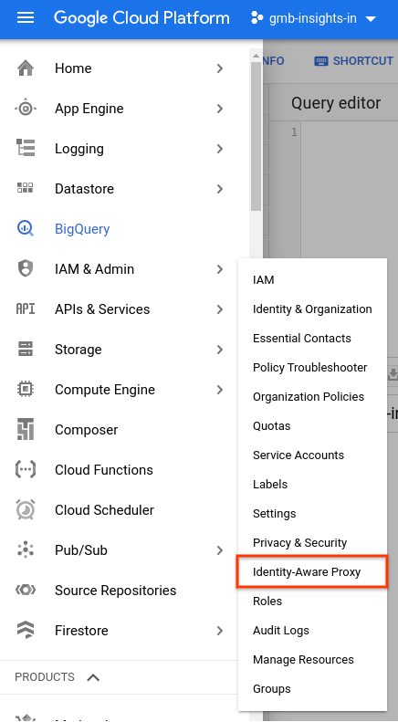
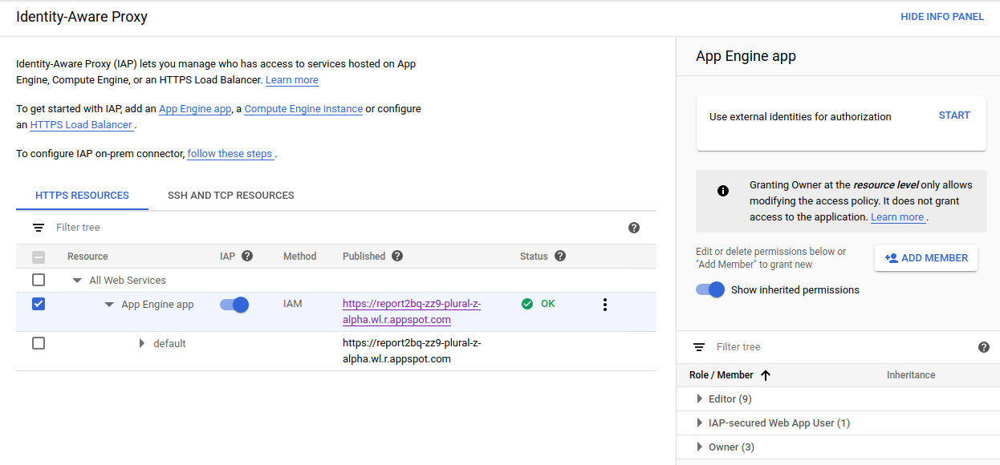

# Report2BQ Authentication and Administration Interface

* Author: David Harcombe (davidharcombe@google.com)
* Type: Open source
* Status: Production

Report2BQ is a scalable, Cloud Functions-based solution to run and fetch
reports from CM and DV360, web-download format reports from SA360 and also
run ADH reports on a schedule.
The entire system has a simple install script, install scripts for setting
up fetchers or runners and a minimal amount of manual actions to be done.

## INSTALLATION GUIDE

### Prerequisites

* A GCP Project in which the current user has Admin access
* The latest version of the Google Cloud SDK and all dependencies, specifically
  the CLI tool
* A checked out copy of the GitHub repo
* An active, valid API Key for the GCP project (steps #3 & #4 of the main installation guide)

### Steps

1. From the root of the cloned repository, change into the `appengine` subdirectory. 
This is where the Administration module is based.

1. Edit the `app.yaml` file in your favourite text editor.  
Modify line 5 (`API_KEY: ""`) and insert your API Key between the quotation marks.  
Save and exit.

1. Deploy the appengine instance:  
`gcloud app deploy --project <YOUR PROJECT>`  
When it finishes, it will show you something like this: \
```
Services to deploy:

descriptor:      [/home/davidharcombe/cse/report2bq/appengine/app.yaml]
source:          [/home/davidharcombe/cse/report2bq/appengine]
target project:  [<YOUR PROJECT>]
target service:  [default]
target version:  [20200706t104653]
target url:      [<YOUR APPENGINE URL>]


Do you want to continue (Y/n)?  

Beginning deployment of service [default]...
╔════════════════════════════════════════════════════════════╗
╠═ Uploading 21 files to Google Cloud Storage               ═╣
╚════════════════════════════════════════════════════════════╝
File upload done.
Updating service [default]...done.                                                                                                                                                                                
Setting traffic split for service [default]...done.                                                                                                                                                               
Deployed service [default] to [<YOUR APPENGINE URL>]
```

1. While this is deploying, we now want to secure the appengine server. So let's go do that.

1. Navigate to the IAM & Admin > Identity Aware Proxy section in the Google Cloud Console  


1. Activate the IAP (if it is not already active). This will take a couple of minutes - hopefully enough time for the appengine instance to have deployed successfully. If not, just let step  #3 finish.

1. When active, ensure that IAP on "App Engine app" is switched on. The appengine uses IAP to ensure you can control who has access - and to get the logged in user's details.
 
1. Now lock it down. You do this by:

    - Select the `App Engine app` checkbox on the left to open the info panel.
    - Click the `Add member` button, and insert the user(s) (`davidharcombe@google.com` for example) or domains (`google.com`) you want to have access.
    - Select the role Cloud IAP > IAP-secured Web App User
    - Click `Save`  
    

1. Allow the newly deployed appengine access to the project's OAuth.
   - Go to the OAuth consent screen at APIs & Services > OAuth consent screen
   - Add `<YOUR APPENGINE URL>` from step #3 to the list of Authorized Domains
   - Save

